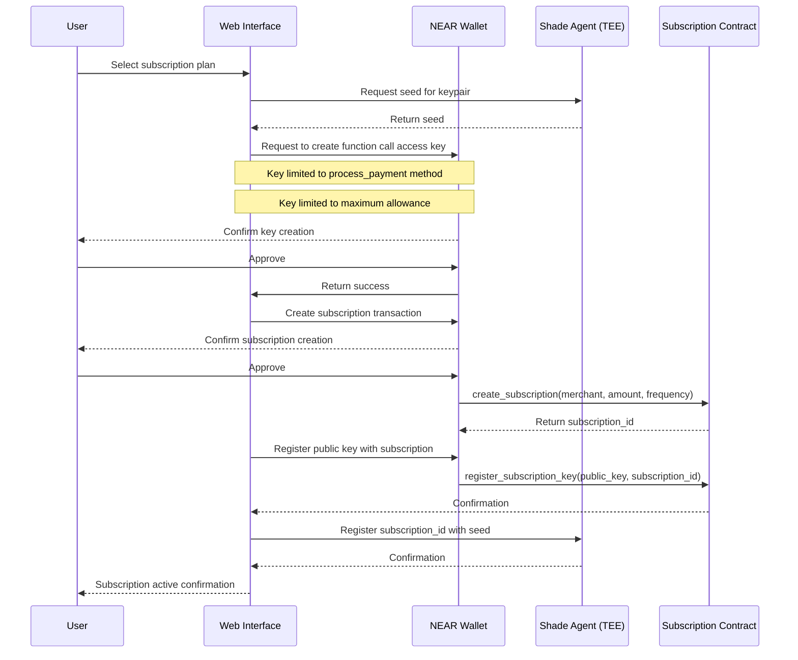
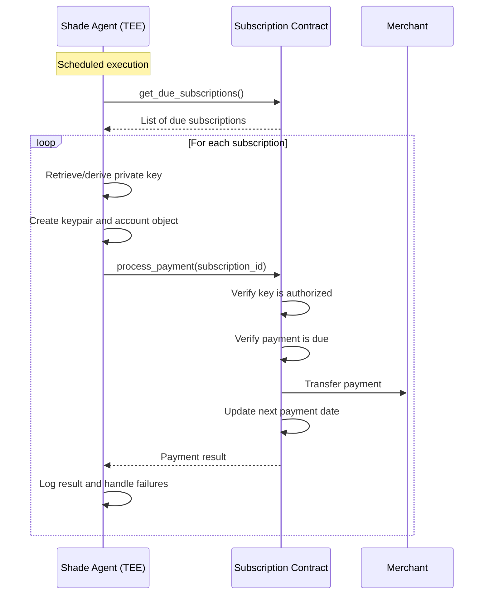
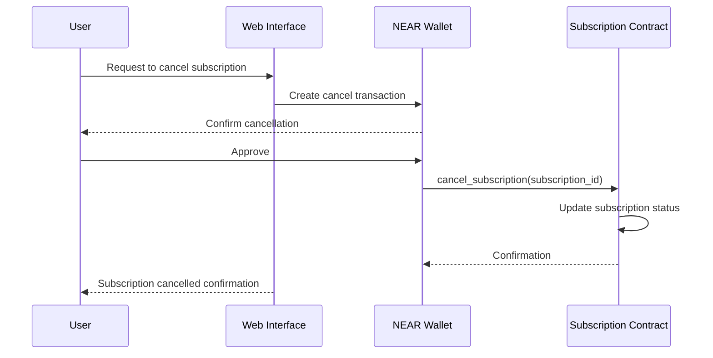
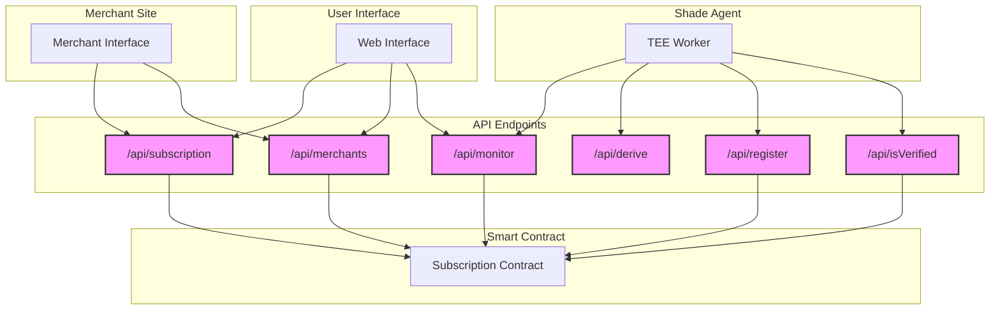
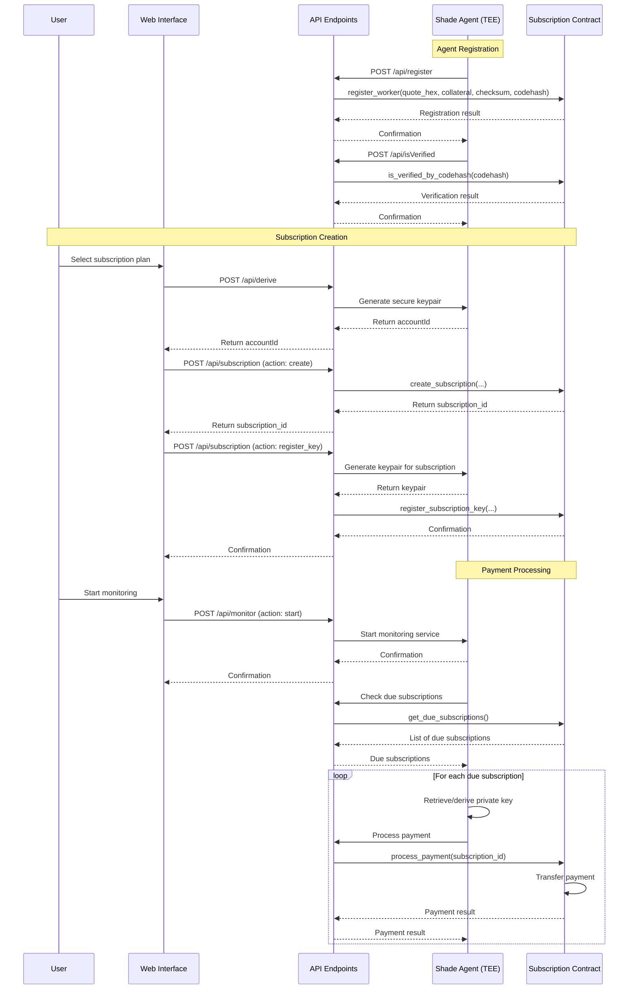

# Subscription Service Architecture

## Overview

This document outlines the architecture for a blockchain-based subscription service using NEAR's Function Call Access Keys and Shade Agents running in Trusted Execution Environments (TEEs). The system enables secure, automated recurring payments without requiring users to pre-fund accounts or approve unlimited spending.

## System Components

### 1. Subscription Smart Contract

A NEAR smart contract that manages:
- Subscription creation and management
- Payment processing
- Access key registration and verification
- Merchant relationships

### 2. Shade Agent

A Worker Agent running in a TEE on Phala Cloud that:
- Monitors subscriptions for due payments
- Securely stores private keys
- Signs and submits payment transactions
- Handles payment failures and retries

### 3. User Interface

A web application that allows users to:
- Create and manage subscriptions
- View payment history
- Pause or cancel subscriptions

## Key Workflows

### Subscription Creation



### Payment Processing



### Subscription Management



## Technical Implementation

### Smart Contract Structure

```rust
#[near(contract_state)]
pub struct SubscriptionContract {
    pub owner_id: AccountId,
    pub approved_agents: IterableSet<String>, // codehashes of approved agents
    pub subscriptions: IterableMap<SubscriptionId, Subscription>,
    pub subscription_keys: LookupMap<PublicKey, SubscriptionId>,
    pub user_subscriptions: LookupMap<AccountId, Vec<SubscriptionId>>,
    pub merchant_subscriptions: LookupMap<AccountId, Vec<SubscriptionId>>,
}

#[near(serializers = [json, borsh])]
pub struct Subscription {
    pub id: SubscriptionId,
    pub user_id: AccountId,
    pub merchant_id: AccountId,
    pub amount: U128,
    pub frequency: SubscriptionFrequency,
    pub next_payment_date: u64,
    pub status: SubscriptionStatus,
    pub created_at: u64,
    pub updated_at: u64,
    pub payment_method: PaymentMethod,
    pub max_payments: Option<u32>,
    pub payments_made: u32,
    pub end_date: Option<u64>,
}

pub enum SubscriptionStatus {
    Active,
    Paused,
    Canceled,
    Failed,
}

pub enum SubscriptionFrequency {
    Daily,
    Weekly,
    Monthly,
    Quarterly,
    Yearly,
}

pub enum PaymentMethod {
    Near,
    Ft { token_id: AccountId },
}
```

### Key Contract Methods

```rust
// User methods
pub fn create_subscription(&mut self, merchant_id: AccountId, amount: U128, frequency: SubscriptionFrequency, ...) -> SubscriptionId;
pub fn register_subscription_key(&mut self, public_key: String, subscription_id: SubscriptionId);
pub fn cancel_subscription(&mut self, subscription_id: SubscriptionId);
pub fn pause_subscription(&mut self, subscription_id: SubscriptionId);
pub fn resume_subscription(&mut self, subscription_id: SubscriptionId);
pub fn get_user_subscriptions(&self, user_id: AccountId) -> Vec<Subscription>;

// Payment processing methods
pub fn process_payment(&mut self, subscription_id: SubscriptionId) -> PaymentResult;
pub fn get_due_subscriptions(&self, limit: u64) -> Vec<Subscription>;

// Admin methods
pub fn register_merchant(&mut self, merchant_id: AccountId, ...);
pub fn approve_agent_codehash(&mut self, codehash: String);
```

### Shade Agent Implementation

The Shade Agent is a Worker Agent running in a TEE on Phala Cloud. It includes:

1. **Key Management Module**:
   - Securely generates and stores seeds for keypairs
   - Derives keypairs when needed for transactions
   - Implements secure key rotation if needed

2. **Subscription Monitor**:
   - Periodically checks for due subscriptions
   - Manages a queue of pending payments
   - Implements retry logic for failed payments

3. **Payment Processor**:
   - Signs and submits payment transactions
   - Verifies transaction success
   - Updates payment status

4. **Reporting Module**:
   - Logs all payment attempts
   - Generates reports for merchants
   - Provides audit trail

### Security Considerations

1. **Key Security**:
   - Private keys never leave the TEE
   - Keys are limited to specific contract methods
   - Keys have maximum allowance limits

2. **TEE Security**:
   - Remote attestation verifies TEE integrity
   - Code hash verification ensures correct execution
   - Hardware-level isolation protects sensitive data

3. **Contract Security**:
   - Access control for all methods
   - Verification of key authorization
   - Rate limiting for payment processing

4. **User Protection**:
   - Clear subscription terms
   - Easy cancellation process
   - Maximum payment limits

## Implementation Roadmap

### Phase 1: Core Infrastructure

1. **Smart Contract Development**:
   - Implement subscription data structures
   - Develop key registration system
   - Create payment processing logic
   - Build subscription management methods

2. **Shade Agent Development**:
   - Set up TEE environment on Phala Cloud
   - Implement key management system
   - Develop subscription monitoring
   - Build payment processing logic

3. **Basic UI**:
   - Create subscription creation flow
   - Implement key generation and registration
   - Develop subscription management interface

### Phase 2: Enhanced Features

1. **Token Support**:
   - Add support for NEAR tokens (NEP-141)
   - Implement token transfer logic
   - Update UI for token selection

2. **Advanced Subscription Options**:
   - Variable pricing based on usage
   - Trial periods and introductory pricing
   - Discount codes and promotions

3. **Merchant Dashboard**:
   - Subscription analytics
   - Payment reporting
   - Customer management

### Phase 3: Cross-Chain Expansion

1. **Chain Signatures Integration**:
   - Implement NEAR Chain Signatures
   - Add support for Base and other EVM chains
   - Develop cross-chain payment routing

2. **Multi-Chain UI**:
   - Update UI for multi-chain support
   - Add chain selection options
   - Implement cross-chain analytics

3. **Advanced Security Features**:
   - Key rotation mechanisms
   - Enhanced audit trails
   - Compliance reporting

## Technical Challenges and Solutions

### Challenge 1: Key Management

**Problem**: Securely generating, storing, and using private keys.

**Solution**: 
- Generate seeds within the TEE
- Derive keypairs deterministically
- Never expose private keys outside the TEE
- Implement secure storage with encryption

### Challenge 2: Payment Reliability

**Problem**: Ensuring payments are processed reliably, even with network issues.

**Solution**:
- Implement robust retry logic
- Use idempotent payment processing
- Maintain a persistent queue of pending payments
- Implement failure notification system

### Challenge 3: Scalability

**Problem**: Handling a large number of subscriptions efficiently.

**Solution**:
- Batch processing of payments
- Efficient storage design in the contract
- Optimized query methods for due subscriptions
- Horizontal scaling of Shade Agents

## API Endpoints

The subscription service exposes several API endpoints that serve different components of the system:



### Endpoint Details

#### 1. `/api/subscription`
**Used by**: User Interface, Merchant Site
**Functions**:
- `create`: Create a new subscription
- `register_key`: Register a key for a subscription
- `get`: Get subscription details
- `get_user_subscriptions`: Get all subscriptions for a user
- `pause`: Pause a subscription
- `resume`: Resume a paused subscription
- `cancel`: Cancel a subscription

#### 2. `/api/merchants`
**Used by**: User Interface, Merchant Site
**Functions**:
- Get a list of registered merchants

#### 3. `/api/monitor`
**Used by**: User Interface, Shade Agent
**Functions**:
- `start`: Start the subscription monitoring service
- `stop`: Stop the subscription monitoring service
- `status`: Get the monitoring status

#### 4. `/api/derive`
**Used by**: Shade Agent
**Functions**:
- Generate a secure account ID within the TEE
- Derive keys using TEE-based entropy

#### 5. `/api/register`
**Used by**: Shade Agent
**Functions**:
- Register the Shade Agent with the contract
- Provide attestation proof of the TEE environment

#### 6. `/api/isVerified`
**Used by**: Shade Agent
**Functions**:
- Verify that the agent's codehash is approved by the contract

### API Integration Flow



## Future Extensions

This architecture provides a secure, flexible foundation for a blockchain-based subscription service. By leveraging NEAR's Function Call Access Keys and the security of TEEs through Shade Agents, it offers a superior alternative to traditional subscription services with enhanced security, transparency, and user control.

The key innovations in this design are:

1. **Secure Key Management**: Using TEEs to securely manage private keys and handle payment processing
2. **Function Call Access Keys**: Leveraging NEAR's unique feature for limited, secure payment authorization
3. **Cross-Chain Potential**: Built-in support for expansion to other chains through NEAR Chain Signatures
4. **User Control**: Full transparency and control over subscription terms and payments
5. **Merchant Flexibility**: Support for various payment models and subscription types

This system demonstrates how blockchain technology, particularly when combined with TEEs and advanced key management, can create more secure, transparent, and user-friendly subscription services.
