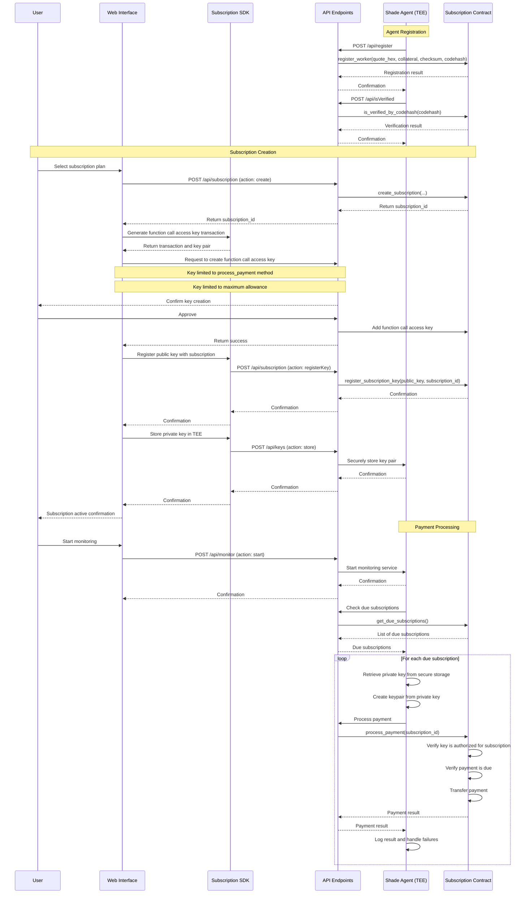

<div align="center">

# Ping Subscription Service

**Secure, automated recurring payments on NEAR blockchain without pre-funding or unlimited approvals**

</div>

## Overview

**Ping Subscription Service** is a blockchain-based subscription service built on the Shade Agent stack. It enables secure, automated recurring payments without requiring users to pre-fund accounts or approve unlimited spending.

The system solves a fundamental problem in blockchain payments: most networks are designed for one-time transactions, not recurring payments. Unlike traditional banking systems with built-in "pull payment" mechanisms, blockchain typically requires manual transaction approval.




For more detailed technical information, see our [Architecture Document](ARCHITECTURE.md).

## Worker Agent Verification

Automatic recurring payments are made possible through the **Shade Agent**, running in a TEE. This secure environment gives us the ability to trust an agent with a private seed, in order to derive the necessary key pair for charging the account. 


The Shade Agent (Worker Agent) running in a TEE verifies itself with the smart contract through:

1. **Account Derivation**: Creates a unique key derived from the TEE's hardware KMS and additional entropy
2. **Remote Attestation**: Obtains a quote from the TEE that proves the environment is secure
3. **Registration**: Submits the attestation quote, collateral, and docker image hash to the smart contract
4. **Verification**: The contract verifies the TEE environment and registers the Worker Agent

Once registered, the Worker Agent can monitor subscriptions and process payments securely.

## Security Considerations

1. **Key Security**:
   - Private keys never leave the TEE
   - Keys are limited to specific contract methods
   - Keys have maximum allowance limits

2. **TEE Security**:
   - Remote attestation verifies TEE integrity
   - Code hash verification ensures correct execution
   - Hardware-level isolation protects sensitive data

3. **Contract Security**:
   - Access control for all methods
   - Verification of key authorization
   - Rate limiting for payment processing

4. **User Protection**:
   - Clear subscription terms
   - Easy cancellation process
   - Maximum payment limits

## Development

### Project Structure

The project is organized as a monorepo with the following components:

- `packages/types`: TypeScript types shared across the project
- `packages/sdk`: TypeScript SDK for interacting with the subscription service
- `api`: API server for the subscription service
- `contract`: Rust smart contract for the subscription service
- `frontend`: Web frontend for the subscription service

### Local Development

```bash
# Install dependencies and build packages
yarn setup

# Start development server
yarn dev
```

### Using the SDK

The TypeScript SDK provides a simple way to interact with the subscription service:

```typescript
import { SubscriptionSDK } from '@pingpay/subscription-sdk/dist/browser';

// Create a new SDK instance
const sdk = new SubscriptionSDK({
  apiUrl: 'http://localhost:3000' // Optional, defaults to this value
});

// Create a subscription
const result = await sdk.createSubscription({
  merchantId: 'merchant.near',
  amount: '1000000000000000000000000', // 1 NEAR
  frequency: 86400, // Daily in seconds
  maxPayments: 30
});

// Generate a function call access key for the subscription
const { transaction, keyPair } = sdk.createSubscriptionKeyTransaction(
  'user.near',
  result.subscriptionId,
  'subscription.near',
  '250000000000000000000000' // 0.25 NEAR allowance
);

// Register the key with the contract
await sdk.registerSubscriptionKey(
  result.subscriptionId,
  keyPair.publicKey
);

// Store the private key in the TEE
await sdk.storeSubscriptionKey(
  result.subscriptionId,
  keyPair.privateKey,
  keyPair.publicKey
);

// Get user subscriptions
const subscriptions = await sdk.getUserSubscriptions('user.near');

// Manage subscriptions
await sdk.pauseSubscription('subscription-id');
await sdk.resumeSubscription('subscription-id');
await sdk.cancelSubscription('subscription-id');

// Monitor subscriptions
await sdk.startMonitoring();
await sdk.stopMonitoring();
const status = await sdk.getMonitoringStatus();
```

For making calls to the NEAR Contract, create a local `.env.development.local` file with:

```bash
NEXT_PUBLIC_accountId=[YOUR_NEAR_DEV_ACCOUNT_ID]
NEXT_PUBLIC_secretKey=[YOUR_NEAR_DEV_ACCOUNT_SECRET_KEY]
NEXT_PUBLIC_contractId=[YOUR_PROTOCOL_NAME].[YOUR_NEAR_DEV_ACCOUNT_ID]
```

### Deployment to Phala Cloud

1. Build and push your docker image:
   ```bash
   # Update docker:build and docker:push scripts in package.json first
   yarn run docker:build
   yarn run docker:push
   ```

2. Update `docker-compose.yaml` with your docker hub account, repository name, and image hash

3. On Phala Cloud:
   - Click "deploy" then "from sketch"
   - Select the "advanced" tab
   - Paste in your updated YAML
   - Give the instance a name and deploy

## What are Shade Agents?

Shade Agents are multichain crypto AI agents, verifiable from source code through to their transactions across any blockchain. They combine the security of Trusted Execution Environments (TEEs) with the transparency of blockchain.

Components of a Shade Agent are:

1. Worker Agent deployment in a TEE
2. Smart Contract to verify a TEE's remote attestation and stack
3. NEAR Intents and Chain Signatures for multichain swaps and key management

## License

This project is licensed under the terms of the MIT license.
