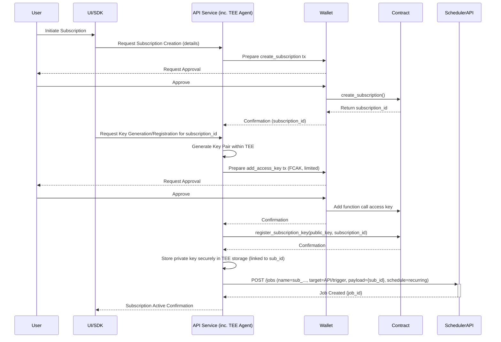
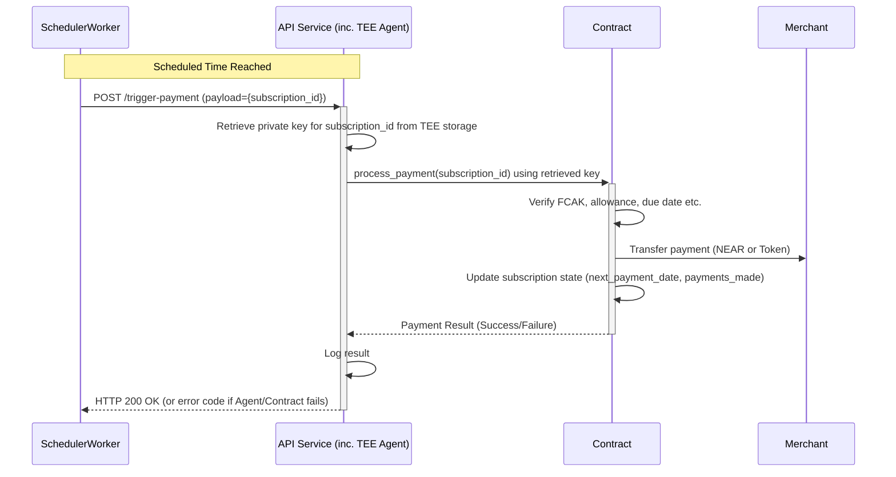

# System Patterns: NEAR Subscription Service

## System Architecture

The subscription service follows a multi-component architecture involving the blockchain, a TEE-enabled API service, a dedicated scheduler, and user interfaces.

```mermaid
graph TD
    subgraph User Interaction
        UI[Frontend UI (Vite)]
        SDK[External SDK Users]
    end

    subgraph Core Services
        API[API Service (Hono + TEE)]
        SCHED[Scheduler Service (BullMQ)]
    end

    subgraph NEAR Blockchain
        SC[Subscription Smart Contract]
    end

    UI --> API
    SDK --> API
    API <--> SC
    API <--> SCHED

    SCHED -- Triggers Job --> API

    style API fill:#f9f,stroke:#333,stroke-width:2px
    style SCHED fill:#ccf,stroke:#333,stroke-width:2px
```

### Components

1.  **Subscription Smart Contract (SC)**: A NEAR smart contract managing subscription lifecycle, payment logic, and FCAK verification.
2.  **API Service (API)**: A Hono backend service running potentially within a TEE (like Phala). It serves the frontend, exposes endpoints for the SDK, interacts with the smart contract, manages secure key storage within its TEE context (acting as the "Shade Agent"), and communicates with the Scheduler Service.
3.  **Scheduler Service (SCHED)**: An external service (using BullMQ/PostgreSQL) responsible for managing timed jobs. It calls a specific endpoint on the API Service when a subscription payment is due.
4.  **Frontend UI (UI)**: A Vite-based web application served by the API Service, allowing users to manage subscriptions.
5.  **SDK**: A JavaScript/TypeScript library for external developers to integrate subscription functionality into their own frontends, interacting primarily with the API Service.

## Key Technical Decisions

1. **Function Call Access Keys**: Using NEAR's Function Call Access Keys to limit payment authorizations to specific methods and maximum allowances.
2. **Trusted Execution Environments**: Using TEEs to securely store and use private keys without exposing them.
3. **Subscription Data Model**: Storing subscription data on-chain for transparency and security.
4. **Payment Processing Trigger**: Using an external Scheduler Service to trigger payment processing at the correct time. The API Service (containing Shade Agent logic) executes the payment upon receiving the trigger.
5. **Key Registration**: Linking public keys to specific subscriptions to authorize payments via FCAKs.

## Design Patterns

### Repository Pattern
- The smart contract acts as a repository for subscription data
- CRUD operations for subscriptions are handled through contract methods

### Observer/Event-Driven Pattern
- The API Service observes subscription lifecycle events (indirectly, via requests resulting from contract interactions) and reacts by managing jobs in the Scheduler Service.
- The Scheduler Service observes time and triggers events (HTTP calls) to the API Service.

### Factory Pattern
- The system creates subscription objects with standardized properties
- Subscription creation follows a defined process with validation

### Command Pattern
- Payment processing is encapsulated as commands
- Commands are executed by authorized agents

### Strategy Pattern
- Different payment methods (NEAR, tokens) can be implemented as strategies
- The system can select the appropriate payment strategy based on subscription configuration

## Component Relationships

### Smart Contract (SC) ↔ API Service (API)
- API calls SC to create/manage subscriptions and register keys.
- API calls SC to process payments (triggered by Scheduler).
- API queries SC for subscription data.
- SC verifies API's TEE attestation/identity for certain operations.

### API Service (API) ↔ Scheduler Service (SCHED)
- API calls SCHED API (`/jobs`) to create/update/delete jobs corresponding to subscription lifecycle changes.
- SCHED Worker calls API endpoint (`/trigger-payment`) when a job is due.

### API Service (API) ↔ Frontend UI (UI) / SDK
- UI/SDK calls API endpoints for subscription management, key generation requests, etc.
- API serves the UI application.
- API provides data retrieved from SC or Agent state to UI/SDK.

## Data Flow

### Subscription Creation & Scheduling


### Scheduled Payment Processing


## Security Model

1. **Key Security**
   - Private keys never leave the TEE
   - Keys are limited to specific contract methods
   - Keys have maximum allowance limits

2. **TEE Security**
   - Remote attestation verifies TEE integrity
   - Code hash verification ensures correct execution
   - Hardware-level isolation protects sensitive data

3. **Contract Security**
   - Access control for all methods
   - Verification of key authorization
   - Rate limiting for payment processing

4. **User Protection**
   - Clear subscription terms
   - Easy cancellation process
   - Maximum payment limits
