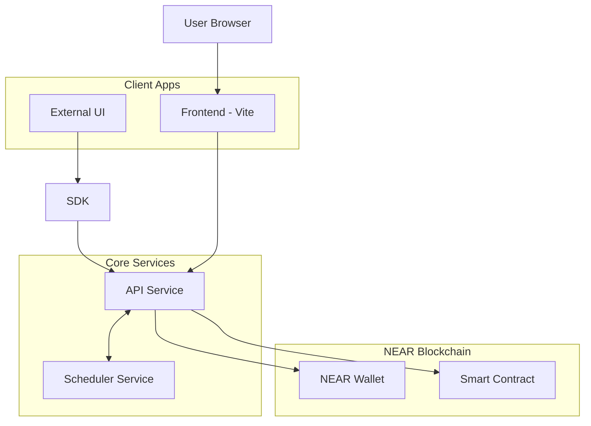

# Technical Context: NEAR Subscription Service

## Technologies Used

### Blockchain
- **NEAR Protocol**: The primary blockchain platform for the subscription service
- **NEAR SDK**: For smart contract development (near-sdk v5.7.0)
- **NEAR API JS**: For frontend interaction with the NEAR blockchain

### TEE (Trusted Execution Environment)
- **Phala Network**: For running Shade Agents in TEEs
- **Phala dstack SDK**: For developing and deploying Shade Agents
- **DCAP QVL**: For TEE attestation verification

### Frontend & API
- **Vite**: Build tool for the frontend application
- **React**: UI library for building the user interface
- **Hono**: Fast, lightweight web framework for the API service
- **BullMQ**: Queue system for the scheduler service
- **PostgreSQL**: Database for the scheduler service

### Development Tools
- **Rust**: For smart contract development
- **TypeScript**: For frontend, API, and agent development
- **Bun**: JavaScript/TypeScript runtime and package manager
- **Docker**: For containerization and deployment

## Development Setup

### Smart Contract Development
- Rust with near-sdk v5.7.0
- Cargo for dependency management
- NEAR CLI for contract deployment and testing

### API & Agent Development
- TypeScript with Hono framework
- Phala dstack SDK for TEE operations
- BullMQ/PostgreSQL for scheduler service
- Bun for runtime and package management

### Frontend Development
- Vite for build tooling
- React for UI components
- NEAR API JS for blockchain interaction
- Bun for package management

## Technical Constraints

### NEAR Protocol Constraints
- Gas limits for contract execution
- Storage costs for on-chain data
- Function call access key limitations
- Cross-contract call restrictions

### TEE Constraints
- Limited computational resources in TEEs
- Network connectivity limitations
- Attestation requirements
- Key management security

### Frontend Constraints
- Browser compatibility
- Wallet integration requirements
- User experience considerations for blockchain interactions

## Dependencies

### Smart Contract Dependencies
```toml
[dependencies]
near-sdk = { version = "5.7.0", features = ["schemars"]}
schemars = { version = "0.8" }
serde_json = "1.0.135"
base64 = "0.22.1"
hex = { version = "0.4", default-features = false, features = ["alloc"] }
dcap-qvl = { git = "https://github.com/mattlockyer/dcap-qvl" }
```

### API Service Dependencies
```json
"dependencies": {
    "@hono/node-server": "^1.13.8",
    "@neardefi/shade-agent-js": "^0.0.12",
    "@phala/dcap-qvl-web": "^0.1.0-beta.2",
    "@phala/dstack-sdk": "^0.1.7",
    "@pingpay/subscription-sdk": "workspace:*",
    "dotenv": "^16.4.7",
    "hono": "^4.7.2",
    "near-api-js": "^5.0.1",
    "near-seed-phrase": "^0.2.1"
}
```

### Frontend Dependencies
```json
"dependencies": {
    "@pingpay/subscription-sdk": "workspace:*"
}
```

### Scheduler Service Dependencies
```json
"dependencies": {
    "bullmq": "^5.1.1",
    "hono": "^4.7.2",
    "pg": "^8.11.3",
    "dotenv": "^16.4.7"
}
```

## Integration Points

### NEAR Blockchain Integration
- Contract deployment and interaction
- Function call access key creation and management
- Transaction signing and submission
- Account management

### Phala TEE Integration
- Worker agent deployment
- Remote attestation
- Secure key storage
- TEE-to-blockchain communication

### Service Integration Points
- **API Service Endpoints**: Routes for subscription management, key operations, and payment triggers
- **Scheduler Service API**: Job management endpoints (`/jobs`) for subscription scheduling
- **Wallet Integration**: Connection for blockchain transactions
- **SDK Integration**: Methods for external frontend integration

## Development Workflow

1. **Smart Contract Development**
   - Write and test smart contract code locally
   - Deploy to NEAR testnet for integration testing
   - Deploy to NEAR mainnet for production

2. **Shade Agent Development**
   - Develop agent code locally
   - Test with simulated TEE environment
   - Deploy to Phala Cloud for production

3. **Frontend Development**
   - Develop UI components
   - Integrate with NEAR wallet
   - Connect to smart contract and agent
   - Test end-to-end workflows

## Deployment Architecture



## Security Considerations

1. **Private Key Management**
   - Keys generated and stored within API Service's TEE context
   - Limited function call access keys with specific allowances
   - Secure key derivation and storage
   - Keys only used when triggered by the scheduler service

2. **Smart Contract Security**
   - Access control for sensitive methods
   - Input validation
   - Economic security (preventing attacks)

3. **TEE Security**
   - Remote attestation
   - Code hash verification
   - Secure communication channels

4. **API & Scheduler Security**
   - No sensitive data in client-side code
   - Secure API endpoints with proper CORS and validation
   - Scheduler-to-API communication secured (IP filtering/authentication)
   - Rate limiting on payment trigger endpoints
   - Proper error handling and logging
